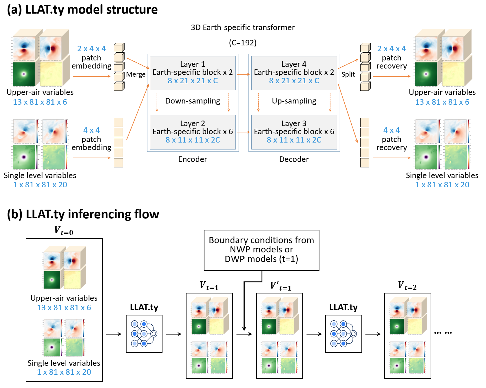
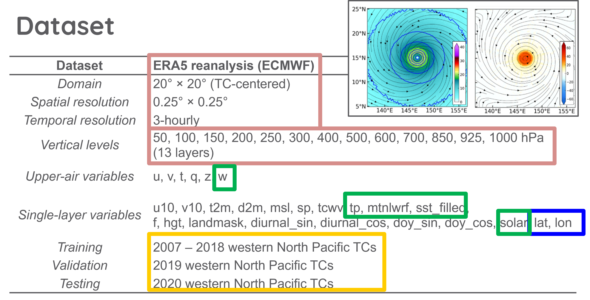
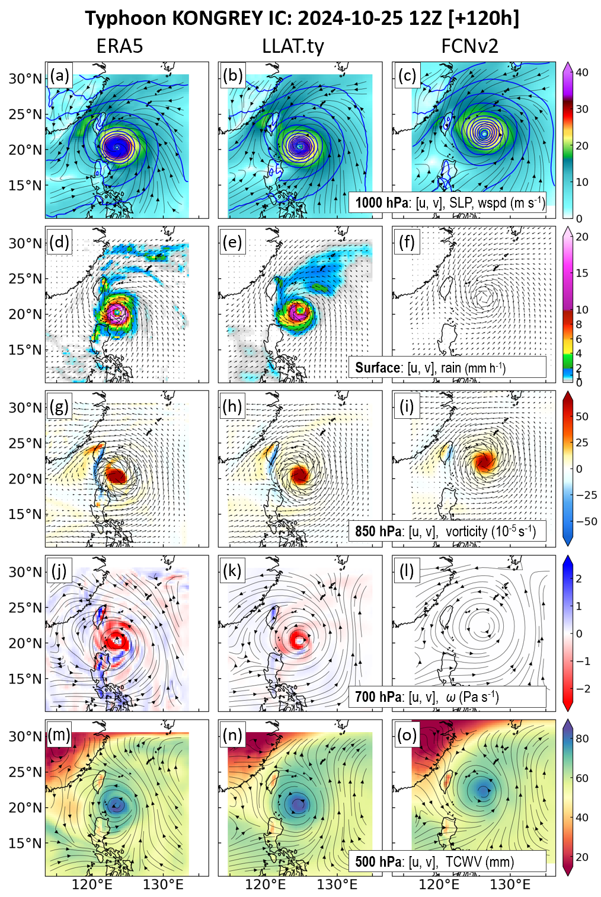

# Official_Implementation_of_Lagrangian_Limited-Area_Transformers_for_Typhoons (LLAT.ty)
**TC following forecasting model**

## Table of Contents
- [Overview](#overview)
- [Installation](#installation)
- [Usage](#usage)
  - [Training the Model](#training-the-model)
  - [Inference](#inference)
- [Scripts](#scripts)
- [Contributing](#contributing)

## Overview
LLAT.ty (Lagrangian Limited-Area Transformers for Typhoons) is a regional AI weather prediction model specifically designed for tropical cyclone forecasting.

Unlike conventional global AI weather models, LLAT.ty operates on a **TC-following moving domain**, allowing the network to continuously focus on the tropical cyclone throughout the forecast. The model is designed for regional prediction while maintaining compatibility with global numerical weather prediction (NWP) models through boundary coupling.

This repository contains the official implementation for

- Data preprocessing
- Model training
- ONNX export
- Inference: regional forecasting with external boundary conditions

The complete FCNV2 two-way coupling framework and visualization examples are available in:
[FCNV2_couple_with_LLAT.ipynb](FCNV2_couple_with_LLAT.ipynb) and 
> https://github.com/yungyun0721/couple_FCNV2_LLAT

## Installation

To set up the project environment:

1. **Clone the Repository**:
   ```bash
   git lfs install
   git clone Official_Implementation_of_Lagrangian_Limited-Area_Transformers_for_Typhoons
   mv Official_Implementation_of_Lagrangian_Limited-Area_Transformers_for_Typhoons LLAT.ty
   cd LLAT.ty
   ```

   *if no git lfs can install by conda*
   ```bash
   conda install -c conda-forge git-lfs
   ```

2. **Set Up the Environment**:
   Option 1 — Micromamba
   - Ensure you have `micromamba` installed. If not, follow the installation instructions from [Micromamba's documentation](https://mamba.readthedocs.io/en/latest/installation.html).
   - Create and activate the `ty` environment:
     ```bash
     micromamba env create -f env_building/min-win_conda_env.yaml
     micromamba activate ty
     ```

   Option 2 — Conda
   - Ensure you have `conda` installed.
   - Create and activate the `ty` environment:
     ```bash
     conda env create -f env_building/min-win_conda_env.yaml
     conda activate ty
     ```


## Usage
LLAT is a regional, TC-following model designed for tropical cyclone forecasting. Its architecture is conceptually similar to Pangu-Weather, but it operates on a moving regional domain centered on the tropical cyclone.



- The variables of LLAT model



- **Training the Model:**
  ```bash
  python train.py
  ```
  If using nano5 HPC:
  ```bash
  sbatch nano5_train_paral.sh
  ```
  This script is tailored for a specific computing cluster using the PJM job scheduler with the following parameters:
  - **partition**: `normal2` or `normal`
  - **Number of Nodes**: 1 GPU node
  - **GPU Cards**: 4
  - **Log Output**: Directed to `log/test.%j.out` and `log/test.%j.err`

- **Exporting to ONNX:**
  ```bash
  python export_onnx.py --ckpt_path path/to/checkpoint.ckpt --output_path path/to/output.onnx
  ```
- **Inference:**
  The LLAT.ty is a regional model. therefore, inferencing the model need global DWP model to provide the boundary condition. The example is 2-way interaction with FCNV2.
  the code is in *FCNV2_couple_with_LLAT.ipynb*. It can work in google colab. 
  - **Note:** The notebook can also be executed directly on Google Colab.For complete operational workflows, visualization, and two-way coupling, please visit `https://github.com/yungyun0721/couple_FCNV2_LLAT`


## Scripts

Here are the scripts available in this project:

- **Training**: 
  - `train.py`
  - `nano5_train_paral.sh` (for nano5 HPC)

- **Inference and Result Plotting**: 
  - `FCNV2_couple_with_LLAT.ipynb` (detailed `https://github.com/yungyun0721/couple_FCNV2_LLAT`)




- **Exporting to ONNX**: `export_onnx.py`


## Contributing

Contributions are welcome! Please follow these steps:

1. Fork the repository.
2. Create your feature branch (`git checkout -b feature/YourFeature`).
3. Commit your changes (`git commit -m 'Add some feature'`).
4. Push to the branch (`git push origin feature/YourFeature`).
5. Open a pull request.